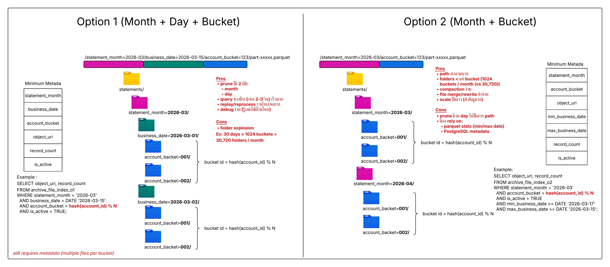

# archive-tier-search-demo

Performance benchmark สำหรับทดสอบการค้นหาข้อมูลใน **Parquet files** ที่แบ่งเป็น partition
เปรียบเทียบ 2 partition layout strategy โดยใช้ **SQLite** เป็น metadata index เขียนด้วย **Rust**

---

## Partition Strategy Overview



> **Option 1 (Month + Day + Bucket)** — partition ละเอียดสุด เหมาะ point query รายวัน
> **Option 2 (Month + Bucket)** — partition compact กว่า เหมาะ range query รายเดือน/ไตรมาส

---

## ภาพรวมสถาปัตยกรรม

```
CSV (raw data)
      │
      ▼  [partition.rs]
      ├─── statements_o1/  ← Option 1: Month + Day + Bucket
      │        statement_month=YYYY-MM/
      │          business_date=YYYY-MM-DD/
      │            account_bucket=N/
      │              part-00001.parquet
      │
      └─── statements_o2/  ← Option 2: Month + Bucket
               statement_month=YYYY-MM/
                 account_bucket=N/
                   part-00001.parquet

Query flow:
  User query → SQLite metadata (get object_uri list) → open parquet files → filter & return
```

**Account bucket** คำนวณจาก `FNV-1a hash(iacct) % NUM_BUCKETS`
ทำให้แต่ละ account ถูก map ไปยัง bucket เดิมเสมอ เพื่อให้ query ระบุ bucket ได้ทันที

---

## โครงสร้างโปรเจค

```
archive-tier-search-demo/
├── Cargo.toml
├── src/bin/
│   ├── generate.rs      # สร้าง mock CSV data 1 ล้าน row
│   ├── partition.rs     # แปลง CSV → Parquet + สร้าง SQLite metadata
│   └── benchmark.rs     # วัด performance: Option 1 vs Option 2
└── data/                # ไฟล์ที่ generate ขึ้นมา (ไม่ถูก commit)
    ├── account_transaction.csv     # raw data  111 MB
    ├── archive_metadata.db         # SQLite metadata index  ~1 MB
    ├── statements_o1/              # Option 1 parquet files  ~85 MB
    └── statements_o2/              # Option 2 parquet files  ~51 MB
```

---

## Data Schema

ตาราง `account_transaction` (odsperf):

| Column        | Type          | Nullable | คำอธิบาย                          |
|---------------|---------------|----------|-----------------------------------|
| `iacct`       | VARCHAR(11)   | NOT NULL | เลขที่บัญชี (BBB + T + SSSSSSS)   |
| `drun`        | DATE          | NOT NULL | วันที่ RUN ข้อมูล = business_date  |
| `cseq`        | INTEGER       | NOT NULL | ลำดับรายการ (per iacct + drun)    |
| `ddate`       | DATE          | NOT NULL | วันที่รายการมีผล                  |
| `dtrans`      | DATE          | ✓        | วันที่ทำรายการ                    |
| `ttime`       | VARCHAR(5)    | ✓        | เวลาทำรายการ (HH:MM)              |
| `cmnemo`      | VARCHAR(3)    | ✓        | รหัสประเภทรายการ                  |
| `cchannel`    | VARCHAR(4)    | ✓        | ช่องทาง (ATM, MOB, WEB, BRN, …)  |
| `ctr`         | VARCHAR(2)    | ✓        | เลขที่โอน                         |
| `cbr`         | VARCHAR(4)    | ✓        | รหัสสาขา                          |
| `cterm`       | VARCHAR(5)    | ✓        | Terminal ID                       |
| `camt`        | VARCHAR(1)    | ✓        | `C` = Credit, `D` = Debit         |
| `aamount`     | NUMERIC(13,2) | ✓        | จำนวนเงินที่ทำรายการ              |
| `abal`        | NUMERIC(13,2) | ✓        | ยอดเงินคงเหลือ                    |
| `description` | VARCHAR(20)   | ✓        | รายละเอียดรายการ                  |
| `time_hms`    | VARCHAR(8)    | ✓        | เวลา (HH:MM:SS)                   |

**Primary Key:** `(iacct, drun, cseq)`

---

## Partition Strategy

### Option 1 — Month + Day + Bucket

```
statements_o1/statement_month=2025-06/business_date=2025-06-15/account_bucket=2/part-00001.parquet
```

**Metadata table:** `archive_file_index_o1`

```sql
CREATE TABLE archive_file_index_o1 (
    id               INTEGER PRIMARY KEY AUTOINCREMENT,
    statement_month  TEXT    NOT NULL,   -- 'YYYY-MM'
    business_date    TEXT    NOT NULL,   -- 'YYYY-MM-DD'  (= drun)
    account_bucket   INTEGER NOT NULL,   -- hash(iacct) % N
    object_uri       TEXT    NOT NULL,
    record_count     INTEGER NOT NULL,
    is_active        INTEGER NOT NULL DEFAULT 1
);
```

**Query pattern:**
```sql
SELECT object_uri, record_count
FROM archive_file_index_o1
WHERE statement_month = '2025-06'
  AND business_date   = '2025-06-15'
  AND account_bucket  = hash(iacct) % 16
  AND is_active = 1;
```

| Pros | Cons |
|------|------|
| Prune ได้ทั้ง month + day | **Folder explosion**: 30 days × 16 buckets = 480 folders/month |
| Point query เร็วมาก (1 file, rows น้อยสุด) | SQLite calls scale ตาม N วัน |
| debug ง่าย ดูแยกวันได้ทันที | replay/reprocess ทำยากกว่า |

---

### Option 2 — Month + Bucket

```
statements_o2/statement_month=2025-06/account_bucket=2/part-00001.parquet
```

**Metadata table:** `archive_file_index_o2`

```sql
CREATE TABLE archive_file_index_o2 (
    id                INTEGER PRIMARY KEY AUTOINCREMENT,
    statement_month   TEXT    NOT NULL,   -- 'YYYY-MM'
    account_bucket    INTEGER NOT NULL,   -- hash(iacct) % N
    object_uri        TEXT    NOT NULL,
    min_business_date TEXT    NOT NULL,   -- min(drun) ในไฟล์นี้
    max_business_date TEXT    NOT NULL,   -- max(drun) ในไฟล์นี้
    record_count      INTEGER NOT NULL,
    is_active         INTEGER NOT NULL DEFAULT 1
);
```

**Query pattern:**
```sql
SELECT object_uri, record_count
FROM archive_file_index_o2
WHERE statement_month   = '2025-06'
  AND account_bucket    = hash(iacct) % 16
  AND is_active         = 1
  AND min_business_date <= '2025-06-15'
  AND max_business_date >= '2025-06-15';
```

| Pros | Cons |
|------|------|
| Path เรียบง่าย | Prune วัน day ไม่ได้จาก path |
| SQLite calls = N months (ไม่ใช่ N days) | ต้อง rely on min/max stats ใน metadata |
| compaction / rewrite ทำง่าย | scan rows มากกว่าสำหรับ point query |
| scale ได้ดีสำหรับ range query | |

---

## ข้อมูล Mock Data

| รายการ               | ค่า                             |
|---------------------|---------------------------------|
| จำนวน rows          | 1,000,000                       |
| ช่วงวันที่ (drun)   | 2025-01-01 ถึง 2025-12-31       |
| จำนวน accounts      | 200 (5 สาขา × 40 บัญชี)        |
| Avg rows ต่อวัน     | ~2,740                          |
| NUM_BUCKETS         | 16                              |
| เวลา generate       | ~750 ms                         |
| เวลา partition      | ~3.0 s                          |

---

## ขนาดไฟล์เปรียบเทียบ

| รายการ                    | Option 1            | Option 2            |
|--------------------------|---------------------|---------------------|
| **จำนวนไฟล์ parquet**    | **5,840**           | **192**             |
| Avg rows ต่อไฟล์          | ~171                | ~5,208              |
| ขนาดไฟล์ (min)           | 10.5 KB             | 181.3 KB            |
| ขนาดไฟล์ (avg)           | 14.9 KB             | 271.6 KB            |
| ขนาดไฟล์ (max)           | 19.4 KB             | 348.5 KB            |
| **รวม disk (parquet)**   | **85.2 MB**         | **50.9 MB**         |
| SQLite metadata          | 1.0 MB (shared)     | 1.0 MB (shared)     |
| Partition granularity    | 365 days × 16 = 5,840 | 12 months × 16 = 192 |

> **หมายเหตุ:** ขนาดไฟล์ที่เล็ก (14.9 KB avg สำหรับ O1) เป็นเพราะ demo ใช้ข้อมูล 1M rows
> กับ partition ที่ละเอียด ใน production จริงที่มีข้อมูล 100M+ rows ต่อเดือน ขนาดจะ scale ขึ้นตามสัดส่วน

---

## Benchmark Results

**Environment:** macOS · Rust release build · 7 iterations · median timing reported
**Column projection:** อ่านเฉพาะ `iacct` + `drun` (2 จาก 16 columns)

### S1 — Point Query (1 day: 2025-06-15)

| Metric           | Option 1   | Option 2   | Advantage  |
|------------------|-----------|-----------|------------|
| SQLite calls     | 1         | 1         | —          |
| Files opened     | 1         | 1         | —          |
| Rows scanned     | 161       | 4,886     | **O1 30×** |
| Rows matched     | 13        | 13        | —          |
| Metadata time    | 10 µs     | 10 µs     | —          |
| File read time   | 65 µs     | 146 µs    | **O1 2.2×**|
| **Total time**   | **75 µs** | 156 µs    | **O1 2.1×**|

---

### S2 — Short Range (3 days: 2025-06-13 → 2025-06-15)

| Metric           | Option 1   | Option 2   | Advantage  |
|------------------|-----------|-----------|------------|
| SQLite calls     | 3         | 1         | O2 3×      |
| Files opened     | 3         | 1         | O2 3×      |
| Rows scanned     | 491       | 4,886     | O1 10×     |
| Rows matched     | 33        | 33        | —          |
| Metadata time    | 70 µs     | 40 µs     | O2 1.8×    |
| File read time   | 323 µs    | 242 µs    | O2 1.3×    |
| **Total time**   | 394 µs    | **282 µs**| **O2 1.4×**|

---

### S3 — Week Range (7 days: 2025-06-09 → 2025-06-15)

| Metric           | Option 1   | Option 2   | Advantage  |
|------------------|-----------|-----------|------------|
| SQLite calls     | 7         | 1         | O2 7×      |
| Files opened     | 7         | 1         | O2 7×      |
| Rows scanned     | 1,119     | 4,886     | O1 4.4×    |
| Rows matched     | 82        | 82        | —          |
| Metadata time    | 79 µs     | 45 µs     | O2 1.8×    |
| File read time   | 502 µs    | 131 µs    | O2 3.8×    |
| **Total time**   | 627 µs    | **167 µs**| **O2 3.8×**|

---

### S4 — Full Month (30 days: 2025-06-01 → 2025-06-30)

| Metric           | Option 1    | Option 2   | Advantage   |
|------------------|------------|-----------|-------------|
| SQLite calls     | 30         | 1         | O2 30×      |
| Files opened     | 30         | 1         | O2 30×      |
| Rows scanned     | 4,886      | 4,886     | —           |
| Rows matched     | 405        | 405       | —           |
| Metadata time    | 169 µs     | 12 µs     | O2 14×      |
| File read time   | 1,230 µs   | 112 µs    | O2 11×      |
| **Total time**   | 1,410 µs   | **127 µs**| **O2 11.1×**|

---

### S5 — Cross-Month Range (6 days: 2025-06-28 → 2025-07-03)

| Metric           | Option 1   | Option 2    | Advantage  |
|------------------|-----------|------------|------------|
| SQLite calls     | 6         | 2          | O2 3×      |
| Files opened     | 6         | 2          | O2 3×      |
| Rows scanned     | 1,012     | 10,101     | O1 10×     |
| Rows matched     | 83        | 83         | —          |
| Metadata time    | 33 µs     | 11 µs      | O2 3×      |
| File read time   | 220 µs    | 185 µs     | O2 1.2×    |
| **Total time**   | 253 µs    | **197 µs** | **O2 1.3×**|

---

### S6 — Quarter Range (91 days: 2025-04-01 → 2025-06-30)

| Metric           | Option 1    | Option 2   | Advantage   |
|------------------|------------|-----------|-------------|
| SQLite calls     | 91         | 3         | O2 30×      |
| Files opened     | 91         | 3         | O2 30×      |
| Rows scanned     | 12,492     | 12,492    | —           |
| Rows matched     | 1,209      | 1,209     | —           |
| Metadata time    | 465 µs     | 25 µs     | O2 18.6×    |
| File read time   | 3,400 µs   | 269 µs    | O2 12.7×    |
| **Total time**   | 3,880 µs   | **304 µs**| **O2 12.8×**|

---

### Summary

| Scenario              | Days | Option 1    | Option 2    | Winner      | Speedup    |
|-----------------------|------|------------|------------|-------------|------------|
| S1 Point Query        | 1    | 75 µs      | 156 µs     | **Option 1**| **2.1×**   |
| S2 Short Range        | 3    | 394 µs     | 282 µs     | **Option 2**| **1.4×**   |
| S3 Week Range         | 7    | 627 µs     | 167 µs     | **Option 2**| **3.8×**   |
| S4 Full Month         | 30   | 1,410 µs   | 127 µs     | **Option 2**| **11.1×**  |
| S5 Cross-Month Range  | 6    | 253 µs     | 197 µs     | **Option 2**| **1.3×**   |
| S6 Quarter Range      | 91   | 3,880 µs   | 304 µs     | **Option 2**| **12.8×**  |

**Option 1 wins: 1 / 6   ·   Option 2 wins: 5 / 6**

---

### Key Insights

- **Option 1 ชนะ** เฉพาะ exact single-day query: 1 SQLite call + 1 file + rows น้อยสุด (~161 rows)
- **Option 2 ชนะ** ทุก range query: จำนวน file-open calls ที่น้อยกว่า dominate wall-clock time
- **Crossover point** อยู่ที่ ~2 วัน — หลังจากนั้น O2's file-open savings > O1's row-scan savings
- **Full-month / Quarter**: O2 เร็วกว่า **11–13×** เพราะ O1 ต้องเปิด 30–91 files เทียบกับ O2 เพียง 1–3 files
- **Rows scanned** สำหรับ full-range query จะเท่ากันทั้ง 2 option (ข้อมูลในเดือนเดียวกัน) แต่ O2 ชนะด้วยจำนวน I/O operations ที่ต่ำกว่า

---

## วิธีใช้งาน

### 1. Build

```bash
cargo build --release
```

### 2. Generate raw CSV data (1M rows)

```bash
./target/release/generate
# → data/account_transaction.csv  (111 MB, ~750 ms)
```

### 3. Partition to Parquet + create metadata DB

```bash
./target/release/partition
# → data/statements_o1/   (5,840 files, 85 MB)
# → data/statements_o2/   (192 files, 51 MB)
# → data/archive_metadata.db  (1 MB, ~3 s)
```

### 4. Run benchmark

```bash
./target/release/benchmark
```

### ปรับค่าตัวแปร

| ค่าคงที่        | ไฟล์              | คำอธิบาย                              |
|----------------|-------------------|---------------------------------------|
| `TOTAL_ROWS`   | `generate.rs`     | จำนวน rows ที่ต้องการ generate        |
| `NUM_ACCOUNTS` | `generate.rs`     | จำนวน unique accounts                 |
| `NUM_BUCKETS`  | `partition.rs`    | จำนวน hash buckets (ต้องตรงกันทุกไฟล์) |
| `NUM_BUCKETS`  | `benchmark.rs`    | ต้องตรงกับ partition.rs               |
| `N_ITERS`      | `benchmark.rs`    | จำนวนรอบ benchmark (median)           |

---

## Roadmap

- [x] Task 1: CSV data generator (1M rows, date range 2025)
- [x] Task 2: README
- [x] Task 3: Parquet partitioning + SQLite metadata index (Option 1 & 2)
- [x] Task 4: Benchmark — metadata-guided search, Option 1 vs Option 2
- [ ] Task 5: Benchmark full-scan baseline (ไม่ใช้ metadata) vs pruned
- [ ] Task 6: เพิ่ม multi-account / bucket-wide query scenarios
- [ ] Task 7: วิเคราะห์ผลกระทบของ NUM_BUCKETS ต่าง ๆ (16, 64, 256, 1024)
